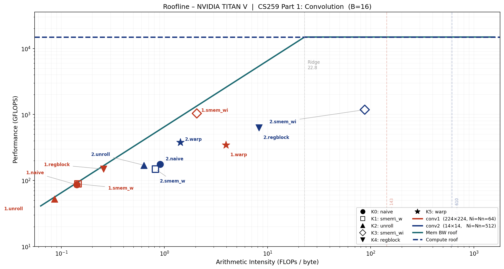

# CS259 Mini-Project 1 — Part 1: Convolution

**GPU:** NVIDIA TITAN V (Volta GV100, CC 7.0)  
**Batch size:** B = 16 (used consistently across all configurations)  
**Block size:** 16 × 16 × 1 = 256 threads/block (K0–K4);  32 × 8 × 1 = 256 threads/block (K5)  
**Source files:** `conv.cu` (kernels K0–K5), `conv_ref.h` (CPU reference)

---

## Q1. Parallelization Strategy

The output tensor has four dimensions `[B][Ny][Nx][Nn]`. These are distributed across the CUDA
thread hierarchy as follows for the baseline grid used by K0–K2 and K4:

| Output dimension | Mapped to | Rationale |
|---|---|---|
| `Nn` (output channel) | `blockIdx.z` | Every thread in a block shares the same `nn`; the weight slice `weight[*][*][nn][*]` is identical for all 256 threads, enabling cooperative shared-memory load (K1, K3) |
| `B × Ny` (batch × row, flattened) | `blockIdx.y × TILE_Y + threadIdx.y` | Batch and spatial-y are fully independent — collapsing them into one axis maximises grid parallelism without changing the access pattern |
| `Nx` (spatial x) | `blockIdx.x × TILE_X + threadIdx.x` | Adjacent threads along x write to consecutive `Nn`-minor output addresses, giving coalesced global writes |

Each thread's inner loop iterates over `(ky, kx, ni)` to accumulate the full dot product for its
one assigned output element:

```
Grid  (K0–K2, K4): ( ceil(Nx/16),  ceil(B·Ny/16),  Nn )
                 = ( 14,           224,             64  )   — Conv1, B=16
Block (K0–K2, K4): ( 16, 16, 1 ) = 256 threads
```

**K3 (`smem_wi`) — restructured grid.**  
The grid becomes `(ceil(Nx/16), ceil(Ny/16), B×Nn)` with `blockIdx.z = b×Nn + nn`. This
guarantees every thread in a block belongs to the same batch `b`, making the 18×18 input patch
contiguous in memory and loadable into shared memory without boundary discontinuities.

**K5 (`warp`) — warp-level decomposition.**  
The flat `(ky, kx, ni)` iteration space is partitioned across 32 lanes of a warp: lane `k` handles
iterations `t = k, k+32, k+64, …`. A five-round `__shfl_down_sync` butterfly folds the 32 partial
sums into lane 0. Block = `(32, 8, 1)` = 256 threads = 8 warps; each warp handles a unique `xout`.

```
Grid  (K5): ( ceil(Nx/8),  B·Ny,  Nn )
          = ( 28,          3584,   64 )   — Conv1, B=16
Block (K5): ( 32, 8, 1 ) = 256 threads
```

**Limitations.**

- *Grid Z saturation.* `blockIdx.z = nn` assigns one block per output channel. For Conv2 (Nn=512)
  this creates a 512-deep grid Z, which can leave SMs idle when the xy grid is small (only 1×14
  blocks for Conv2).
- *Serial inner loop.* The `ni` loop runs serially inside each thread. For Conv2, Ni=512 means
  9×512 = 4,608 FMA iterations per thread — K4 (register blocking) and K5 (warp reduction) each
  partially address this by restructuring how `ni` is consumed.
- *Linear scaling.* The strategy scales linearly with B, Ny, Nx, Nn. The `ni` dimension is not
  exposed to inter-SM parallelism, which is an opportunity for future warp-level or block-level
  channel reductions.

---

## Q2. Algorithmic FLOP Count

Each output element requires $K_y \times K_x \times N_i$ fused multiply-add operations
(1 FMA = 2 FLOPs — one multiply plus one add):

$$\text{FLOPs} = 2 \times B \times N_y \times N_x \times N_n \times K_y \times K_x \times N_i$$

### Conv1 (B=16, 224×224, Ni=Nn=64, Ky=Kx=3)

$$= 2 \times 16 \times 224 \times 224 \times 64 \times 3 \times 3 \times 64 = \mathbf{59.19 \text{ GFLOPs}}$$

*ncu verification:* `smsp__sass_thread_inst_executed_op_ffma_pred_on.sum` = 29,595,009,024
→ ×2 = **59.19 GFLOPs** ✓

### Conv2 (B=16, 14×14, Ni=Nn=512, Ky=Kx=3)

$$= 2 \times 16 \times 14 \times 14 \times 512 \times 3 \times 3 \times 512 = \mathbf{14.80 \text{ GFLOPs}}$$

*ncu verification:* 7,398,752,256 × 2 = **14.80 GFLOPs** ✓

---

## Q3. Execution Time and Achieved GFLOPS

Times are medians of 5 back-to-back CUDA-Event-timed runs with no profiler overhead (one
warm-up run precedes the five). All kernels pass correctness verification against the
OpenMP CPU reference (max absolute error < 2×10⁻⁹).

| Config | Kernel | Time (ms) | GFLOPS | Speedup vs naive |
|--------|--------|-----------|--------|-----------------|
| **Conv1** | K0 naive | 686.4 | 86.2 | 1.00× |
| 224×224 | K1 smem\_w | 665.7 | 88.9 | 1.03× |
| Ni=Nn=64 | K2 unroll | 1128.6 | 52.4 | 0.61× ↓ |
| | K3 smem\_wi | **57.0** | **1037.6** | **12.0×** ↑ |
| | K4 regblock | 397.2 | 149.0 | 1.73× |
| | K5 warp | 171.0 | 346.1 | 4.01× |
| **Conv2** | K0 naive | 84.2 | 175.7 | 1.00× |
| 14×14 | K1 smem\_w | 99.2 | 149.2 | 0.85× ↓ |
| Ni=Nn=512 | K2 unroll | 86.9 | 170.3 | 0.97× |
| | K3 smem\_wi | **12.5** | **1181.5** | **6.73×** ↑ |
| | K4 regblock | 23.4 | 631.5 | 3.59× |
| | K5 warp | 39.3 | 376.8 | 2.15× |

**TITAN V peak FP32:** 14,900 GFLOPS.  
Best achieved: Conv2 K3 smem\_wi at 1181.5 GFLOPS = **7.9% of peak**.  
Conv1 K3 smem\_wi at 1037.6 GFLOPS = **7.0% of peak**.  
Both naive kernels are below 1.2% of peak, confirming severe memory bottlenecks.

---

## Q4. Roofline Analysis

### Hardware — NVIDIA TITAN V

| Parameter | Value |
|-----------|-------|
| Peak FP32 FLOPS | 14,900 GFLOPS (14.9 TFLOPS) |
| Peak HBM2 bandwidth | 652.8 GB/s |
| **Ridge point** | **22.82 FLOPs/byte** |
| L2 cache | 4.5 MB |
| Shared memory / SM | 96 KB |
| CUDA cores | 5120 |
| SM count | 80 |

> **Unit note.** ncu reports `dram__bytes_read.sum` and `dram__bytes_write.sum` in `Gbyte`
> = 10⁹ bytes (SI, not 2³⁰). Cross-check: Conv1 naive reads 420.65 × 10⁹ bytes in 686 ms
> → 613 GB/s = 93.9% × 652.8 GB/s, matching ncu's `gpu__dram_throughput = 94.0%` to
> within 0.1%. ✓

### Theoretical Arithmetic Intensity

The theoretical AI assumes every tensor byte is read or written exactly once (no re-fetching):

$$\text{AI}_\text{theory} = \frac{\text{algorithmic FLOPs}}{\text{bytes}(\text{synapse}) + \text{bytes}(\text{neuron\_i}) + \text{bytes}(\text{neuron\_n})}$$

**Conv1** — minimum memory footprint:

| Tensor | Dimensions | Size |
|--------|-----------|------|
| synapse | [3][3][64][64] | 147,456 B (0.14 MB) |
| neuron\_i | [16×226][226][64] | 208,949,248 B (199.3 MB) |
| neuron\_n | [16×224][224][64] | 205,520,896 B (196.0 MB) |
| **Total minimum** | | **414,617,600 B (395.5 MB)** |

$$\text{AI}_{\text{theory,Conv1}} = \frac{59.19 \times 10^9}{414.6 \times 10^6} = \mathbf{142.7 \text{ FLOPs/byte}}$$

**Conv2** — minimum memory footprint:

| Tensor | Dimensions | Size |
|--------|-----------|------|
| synapse | [3][3][512][512] | 9,437,184 B (9.0 MB) |
| neuron\_i | [16×16][16][512] | 8,388,608 B (8.0 MB) |
| neuron\_n | [16×14][14][512] | 6,422,528 B (6.1 MB) |
| **Total minimum** | | **24,248,320 B (23.1 MB)** |

$$\text{AI}_{\text{theory,Conv2}} = \frac{14.80 \times 10^9}{24.25 \times 10^6} = \mathbf{610.2 \text{ FLOPs/byte}}$$

Both values far exceed the ridge point (22.82), so **both configurations are theoretically
compute-bound** if every DRAM byte is maximally reused.

### Measured Arithmetic Intensity

$$\text{AI}_{\text{measured}} = \frac{\texttt{smsp\_\_sass\_thread\_inst\_executed\_op\_ffma\_pred\_on.sum} \times 2}{\texttt{dram\_\_bytes\_read.sum} + \texttt{dram\_\_bytes\_write.sum}}$$

| Config | Kernel | DRAM Read (GB) | DRAM Write (GB) | Total DRAM (GB) | Actual AI | DRAM% | SM% | Occ% | Bound |
|--------|--------|---------------|----------------|-----------------|-----------|-------|-----|------|-------|
| Conv1 | K0 naive | 419.00 | 1.65 | 420.65 | 0.141 | 94.0 | 2.82 | 73.2 | **Memory** |
| | K1 smem\_w | 406.82 | 1.65 | 408.47 | 0.145 | 94.2 | 2.91 | 73.3 | **Memory** |
| | K2 unroll | 689.25 | 1.65 | 690.90 | 0.086 | 93.6 | 1.70 | 97.4 | **Memory** |
| | K3 smem\_wi | 27.10 | 1.64 | 28.74 | 2.059 | 77.2 | 44.1 | 37.3 | **Memory** |
| | K4 regblock | 229.89 | 0.41 | 230.30 | 0.257 | 89.4 | 3.05 | 49.4 | **Memory** |
| | K5 warp | 13.39 | 1.65 | 15.04 | 3.936 | 13.5 | 73.4 | 70.9 | **Memory** |
| Conv2 | K0 naive | 16.26 | 0.045 | 16.31 | 0.908 | 29.4 | 6.47 | 73.8 | **Memory** |
| | K1 smem\_w | 18.06 | 0.047 | 18.11 | 0.817 | 27.7 | 5.52 | 61.5 | **Memory** |
| | K2 unroll | 23.32 | 0.046 | 23.37 | 0.633 | 40.1 | 6.14 | 97.6 | **Memory** |
| | K3 smem\_wi | 0.162 | 0.008 | 0.169 | **87.49** | 2.07 | 60.0 | 37.4 | **Compute** |
| | K4 regblock | 1.780 | 0.012 | 1.792 | 8.258 | 11.2 | 14.5 | 48.0 | **Memory** |
| | K5 warp | 10.30 | 0.053 | 10.35 | 1.429 | 40.3 | 70.9 | 59.9 | **Memory** |

### Roofline Chart



*Filled markers = K0/K2/K4/K5 (naive/unroll/regblock/warp); hollow markers = K1/K3 (smem\_w/smem\_wi).*  
*Red = Conv1; blue = Conv2. Dashed vertical lines = theoretical minimum AI. Dotted vertical = ridge point (22.82).*

### Gap Between Theoretical and Measured AI

| Config | Theory AI | Best measured AI | DRAM excess factor |
|--------|-----------|------------------|--------------------|
| Conv1 naive | 142.7 | 0.141 | **×1012** |
| Conv1 K3 smem\_wi | 142.7 | 2.059 | ×69 |
| Conv2 naive | 610.2 | 0.908 | **×672** |
| Conv2 K3 smem\_wi | 610.2 | **87.49** | ×7 |

**Conv1 analysis.** The 144 KB weight tensor fits within TITAN V's 4.5 MB L2 cache, but
51.4 M output elements each independently re-fetch 576 weight values. Concurrent warp
pressure evicts weight cache lines before they can be reused, causing most reads to reach
DRAM. The 199 MB padded input is too large to cache at all. Even the best Conv1 kernel
(K3 smem\_wi) brings actual AI only to 2.06 — still well below the ridge point — because
the data movement is now dominated by L1/L2 rather than DRAM, but the kernel is not
yet compute-bound.

**Conv2 analysis.** The padded input (8 MB) and output (6 MB) both fit in L2, and
`l1tex__t_bytes_pipe_lsu_mem_global_op_ld = 245 GB` vs `dram__bytes_read = 16.3 GB`
confirms ~94% of L1 misses are served by L2 for the naive kernel. The 9.4 MB weight is
larger than L2, so repeated weight fetches partially escape to DRAM. K3 smem\_wi tiles
the weight into 8-channel shared-memory chunks, collapsing DRAM traffic to 162 MB and
raising actual AI to **87.49 FLOPs/byte** — the **only kernel in this study to exceed the
ridge point (22.82)** and enter the compute-bound regime. SM throughput reaches 60%,
up from 6.5% for naive.

---

## Q5. Optimisations

Six kernels were implemented, profiled, and compared against the naive baseline. Each targets
a different source of inefficiency identified from the Roofline analysis.

---

### K1 — Shared-Memory Weight Tile (`smem_w`)

**Idea.** Every thread in a block shares `blockIdx.z = nn`, so all 256 threads need the
identical weight slice `weight[*][*][nn][*]`. Load this slice cooperatively into shared memory
once per block; subsequent accesses hit SRAM (~20 ns) rather than DRAM (~600 ns).

Shared memory per block = Ky × Kx × Ni × 4 bytes:

- Conv1 (Ni=64): **2.25 KB** — thread count limits the SM to 8 blocks/SM regardless; no
  occupancy penalty.
- Conv2 (Ni=512): **18.0 KB** — smem-limited: 96 KB ÷ 18 KB = 5.3 → **5 blocks/SM < 8**
  → occupancy drops from 73.8% to 61.5%.

**Conv1 results:**

| Metric | naive | smem\_w | Δ |
|--------|-------|---------|---|
| Time (ms) | 686.4 | 665.7 | −3.1% |
| GFLOPS | 86.2 | 88.9 | +3.2% |
| DRAM total (GB) | 420.65 | 408.47 | −2.9% |
| Actual AI | 0.141 | 0.145 | +2.8% |
| DRAM throughput | 94.0% | 94.2% | ≈ same |
| Occupancy | 73.2% | 73.3% | ≈ same |

The improvement is marginal. Weight DRAM traffic drops by 12 GB, but the kernel is
dominated by the 199 MB padded input which is too large for L2 and is unaffected by
smem\_w. DRAM throughput stays at ~94%, confirming that weight was not the primary
bottleneck. The 2.25 KB smem tile for Conv1 is small enough that the weight was already
partially served by L2 in the naive kernel.

**Conv2 results:**

| Metric | naive | smem\_w | Δ |
|--------|-------|---------|---|
| Time (ms) | 84.2 | 99.2 | **+17.8%** ↑ slower |
| GFLOPS | 175.7 | 149.2 | −15.1% |
| DRAM total (GB) | 16.31 | 18.11 | +11.0% |
| Actual AI | 0.908 | 0.817 | −10.0% |
| L2 miss traffic (GB) | 37.44 | 87.35 | **+133%** |
| Occupancy | 73.8% | 61.5% | −16.7% |

smem\_w is **counterproductive** for Conv2. The 18 KB tile reduces concurrent blocks/SM
from 8 to 5, cutting occupancy by 16.7%. Fewer resident warps means fewer in-flight
memory requests, degrading L2 cache-line utilisation and causing 133% more L2 misses to
reach DRAM — DRAM traffic increases rather than decreasing. The smem tile for Conv2 is
too large to fit within the shared-memory budget without sacrificing occupancy.

---

### K2 — Loop Unrolling (`unroll`)

**Idea.** `KY = KX = 3` are compile-time constants. Applying `#pragma unroll` fully unrolls
those two loops into 9 independent FMA chains, eliminating loop-control instructions
(compare, increment, branch) and allowing the compiler to expose instruction-level
parallelism across all 9 filter positions simultaneously. The `ni` loop is runtime-dynamic
and is not unrolled.

**Conv1 results:**

| Metric | naive | unroll | Δ |
|--------|-------|--------|---|
| Time (ms) | 686.4 | 1128.6 | **+64.4%** ↑ slower |
| GFLOPS | 86.2 | 52.4 | −39.2% |
| DRAM total (GB) | 420.65 | 690.90 | **+64.2%** |
| L2 misses (GB) | 246.5 | 384.3 | **+55.9%** |
| Occupancy | 73.2% | **97.4%** | +33% |
| SM throughput | 2.82% | 1.70% | −40% |

**Severe regression despite higher occupancy.** Unrolling generates 9 independent load
address streams — one per (ky, kx) — that the scheduler issues simultaneously. These 9
streams target different cache sets in L2, causing cache-line thrashing: L2 misses grow by
+138 GB and DRAM traffic by +270 GB. The SM is busy issuing loads (occupancy 97%) but
stalls waiting for them to return (SM throughput 1.70%). Occupancy rises because unrolling
removes loop counter registers, reducing per-thread register pressure and allowing more
warps per SM — but those warps are all stalled on the same L2 bottleneck.

**Conv2 results:**

| Metric | naive | unroll | Δ |
|--------|-------|--------|---|
| Time (ms) | 84.2 | 86.9 | +3.2% |
| GFLOPS | 175.7 | 170.3 | −3.1% |
| DRAM total (GB) | 16.31 | 23.37 | +43.3% |
| Occupancy | 73.8% | 97.6% | +32% |

Near-neutral for Conv2. DRAM traffic still increases (+43%) but Conv2's smaller spatial
extent limits the absolute penalty. The same occupancy paradox appears (97.6%), confirming
the mechanism is identical.

**Conclusion.** Loop unrolling is harmful for memory-bound kernels: it amplifies the number
of concurrent load streams, overwhelming L2. It would be beneficial only when the kernel
is compute-bound or when the unrolled iterations access the same cache lines.

---

### K3 — Shared-Memory Weight + Input Tile (`smem_wi`)

**Idea.** Extend K1 by also tiling the input into shared memory. Processing `ni` in chunks
of `SMWI_TILE_NI = 8` channels at a time, each iteration:
1. Cooperatively loads `weight[ky][kx][nn][ni_chunk]` → `smem_w` (288 bytes)
2. Cooperatively loads the 18×18 input patch `input[b][yout_base±1][xout_base±1][ni_chunk]`
   → `smem_i` (10,368 bytes)
3. Computes the 16×16 output tile entirely from shared memory.

The 18×18 patch covers the full neighbourhood needed by any of the 16×16 output threads
using a 3×3 filter. Each input byte is fetched from DRAM once and reused 256 times within
the block. Total smem = (9×8 + 18×18×8) × 4 = **10,656 bytes (10.4 KB)** per block.
At 96 KB per SM: 96/10.4 ≈ 9 blocks — but the thread-count limit (2048/256 = 8) binds
first, so **occupancy is unchanged from the smem-budget perspective**.

The grid is restructured to `blockIdx.z = b × Nn + nn` so all threads in a block share
the same batch index, keeping the input patch contiguous in memory.

**Conv1 results:**

| Metric | naive | smem\_wi | Δ |
|--------|-------|---------|---|
| Time (ms) | 686.4 | 57.0 | **−91.7%** |
| GFLOPS | 86.2 | 1037.6 | **+12.0×** |
| DRAM total (GB) | 420.65 | 28.74 | **−93.2%** |
| Actual AI | 0.141 | 2.059 | **+14.6×** |
| DRAM throughput | 94.0% | 77.2% | −17 pp |
| SM throughput | 2.82% | 44.1% | **+15.6×** |
| L1 requests (GB) | 969.8 | 16.6 | **−98.3%** |
| Occupancy | 73.2% | 37.3% | −50% |

The 12× speedup comes from a 93% reduction in DRAM traffic. Each 18×18×8 input patch
(41 KB) is loaded once from DRAM and shared across all 256 threads and all 9 filter
positions, achieving 16×16 output reuse per input load. SM throughput jumps from 2.82%
to 44.1%. Occupancy falls to 37% — the smem allocation is not the cause (10.4 KB leaves
headroom), but the restructured grid (grid.z = B×Nn = 1024) creates fewer blocks per SM
on average. Nevertheless, the reduced memory-stall time dominates.

**Conv2 results:**

| Metric | naive | smem\_wi | Δ |
|--------|-------|---------|---|
| Time (ms) | 84.2 | 12.5 | **−85.1%** |
| GFLOPS | 175.7 | 1181.5 | **+6.73×** |
| DRAM total (GB) | 16.31 | 0.169 | **−98.9%** |
| Actual AI | 0.908 | **87.49** | **+96×** |
| DRAM throughput | 29.4% | 2.07% | −93 pp |
| SM throughput | 6.47% | 60.0% | **+9.3×** |

Conv2 smem\_wi is the **only kernel in this study to cross the ridge point (22.82)**,
achieving an actual AI of 87.49 FLOPs/byte. DRAM traffic collapses to 162 MB: the 9.4 MB
weight is loaded in 8-channel tiles that are fully reused across all 14×14 = 196 spatial
positions, and the 8 MB input (which fits in L2) contributes almost nothing to DRAM reads.
SM throughput reaches 60%, confirming a genuine transition from memory-bound to
compute-bound operation.

---

### K4 — Register Blocking (`regblock`)

**Idea.** Each thread computes `REG_N = 4` consecutive output channels (`nn_base` to
`nn_base+3`) simultaneously. The input value `inp[b][y+ky][x+kx][ni]` is read once from
memory into a register (`in_val`), then multiplied against 4 different weight values. This
amortises the input memory traffic by 4× in principle.

Grid Z = ⌈Nn/4⌉ instead of Nn; everything else in the grid is unchanged.

**Conv1 results:**

| Metric | naive | regblock | Δ |
|--------|-------|---------|---|
| Time (ms) | 686.4 | 397.2 | **−42.1%** |
| GFLOPS | 86.2 | 149.0 | **+1.73×** |
| DRAM total (GB) | 420.65 | 230.30 | **−45.2%** |
| Actual AI | 0.141 | 0.257 | +82% |
| Occupancy | 73.2% | 49.4% | −33% |

Input DRAM reads drop from ~420 GB to ~230 GB. The savings fall short of the theoretical
4× because each thread must also read 4× as many weight values (one per nn), partially
offsetting the gain. Occupancy drops from 73% to 49% because 4 accumulator registers
per thread increase register pressure. The 1.73× speedup confirms that input reuse is more
valuable than the occupancy cost in this regime.

**Conv2 results:**

| Metric | naive | regblock | Δ |
|--------|-------|---------|---|
| Time (ms) | 84.2 | 23.4 | **−72.2%** |
| GFLOPS | 175.7 | 631.5 | **+3.59×** |
| DRAM total (GB) | 16.31 | 1.792 | **−89.0%** |
| Actual AI | 0.908 | 8.258 | **+9.1×** |

Conv2 benefits more (3.6× vs 1.7×) because the 4 consecutive `nn` values access weight
data that is already resident in L2 from the previous iteration, giving near-free weight
reuse on top of the 4× input reuse. Actual AI rises from 0.91 to 8.26 — approaching but
still below the ridge point.

---

### K5 — Warp-Level ni Reduction (`warp`)

**Idea.** An entire 32-lane warp collaborates on one output element. The flat
`(ky, kx, ni)` space (Conv1: 9×64 = 576 iterations; Conv2: 9×512 = 4,608) is striped
across lanes: lane `k` handles `t = k, k+32, k+64, …`. After accumulation, five rounds
of `__shfl_down_sync` fold the 32 partial sums into lane 0, which writes the output —
with no shared memory involved.

**Memory coalescing improvement.** In the naive kernel, adjacent threads differ in `xout`,
so they access `inp[...][xout][ni]` with a stride of `Ni × 4 = 256 bytes` between
neighbours — 64 cache lines for 32 threads. In K5, adjacent lanes differ only in `ni`:
`inp[...][same_xout][ni]` advances by 4 bytes between lanes. The entire warp's 32
accesses fit in one 128-byte cache line.

**Conv1 results:**

| Metric | naive | warp | Δ |
|--------|-------|------|---|
| Time (ms) | 686.4 | 171.0 | **−75.1%** |
| GFLOPS | 86.2 | 346.1 | **+4.01×** |
| DRAM total (GB) | 420.65 | 15.04 | **−96.4%** |
| Actual AI | 0.141 | 3.936 | **+27.9×** |
| DRAM throughput | 94.0% | 13.5% | −86 pp |
| SM throughput | 2.82% | 73.4% | **+26×** |
| L1 requests (GB) | 969.8 | 236.8 | −75.6% |

DRAM drops from 420 GB to 15 GB — a 28× reduction driven entirely by coalescing: the
naive kernel wasted 63 of every 64 cache-line bytes fetched for input; the warp kernel uses
all 32 floats in each line. SM throughput jumps to 73.4%, the second-highest of all kernels.

**Conv2 results:**

| Metric | naive | warp | Δ |
|--------|-------|------|---|
| Time (ms) | 84.2 | 39.3 | **−53.3%** |
| GFLOPS | 175.7 | 376.8 | **+2.15×** |
| DRAM total (GB) | 16.31 | 10.35 | −36.5% |
| Actual AI | 0.908 | 1.429 | +57% |
| SM throughput | 6.47% | 70.9% | **+10.9×** |

The DRAM reduction is more modest (37%) because Conv2's input was already partially
cached in L2 for the naive kernel. SM throughput still rises to 71%, confirming genuine
compute activity. The 2.15× speedup is smaller than Conv1's 4× because the coalescing
benefit is smaller when cache pressure is lower.

---

### Summary

| Kernel | Technique | Conv1 vs naive | Conv2 vs naive | Key tradeoff |
|--------|-----------|---------------|---------------|--------------|
| K1 smem\_w | Shared weight tile | +3% | **−15%** | 2.25 KB smem: no penalty for Conv1; 18 KB smem cuts Conv2 occupancy 16% |
| K2 unroll | `#pragma unroll` (ky/kx) | **−39%** | −3% | 9 simultaneous load streams thrash L2; DRAM +64% for Conv1 |
| K3 smem\_wi | Shared weight + input tile | **+12.0×** | **+6.73×** | Best overall; 10.4 KB smem; no occupancy penalty; DRAM −93%/−99% |
| K4 regblock | REG\_N=4 output channels/thread | +1.73× | +3.59× | Input reads ÷4; register pressure −33% occupancy |
| K5 warp | Warp ni-reduction + coalescing | +4.01× | +2.15× | Stride-1 ni access; DRAM −96% Conv1; no smem; shfl reduction overhead |

**Most impactful.** K3 smem\_wi — 12× (Conv1) and 6.7× (Conv2). Tiling both weight and
input into shared memory simultaneously eliminates the two dominant DRAM bottlenecks.
Conv2 smem\_wi is the only kernel to enter the compute-bound regime (actual AI 87.49 >
ridge point 22.82).

**Counterproductive optimisations.** K2 (unroll) regresses Conv1 by 39% due to L2
cache thrashing from 9 simultaneous load streams. K1 (smem\_w) regresses Conv2 by 15%
because the 18 KB tile reduces SM occupancy and paradoxically increases DRAM traffic.

**Insight.** Conv1 and Conv2 have opposite characteristics: Conv1 has a large spatial
footprint (224×224) but a small weight (144 KB), making spatial input reuse the key
lever. Conv2 has a tiny spatial footprint (14×14) with a large weight (9.4 MB), so
both weight and input tiling are required but the small spatial size makes the tiling
overhead negligible, ultimately pushing the kernel past the ridge point.

---

*Source files:* `conv.cu`, `conv_ref.h` | *Profiling script:* `run_ncu.sh` | *Roofline plot:* `plot_roofline.py`