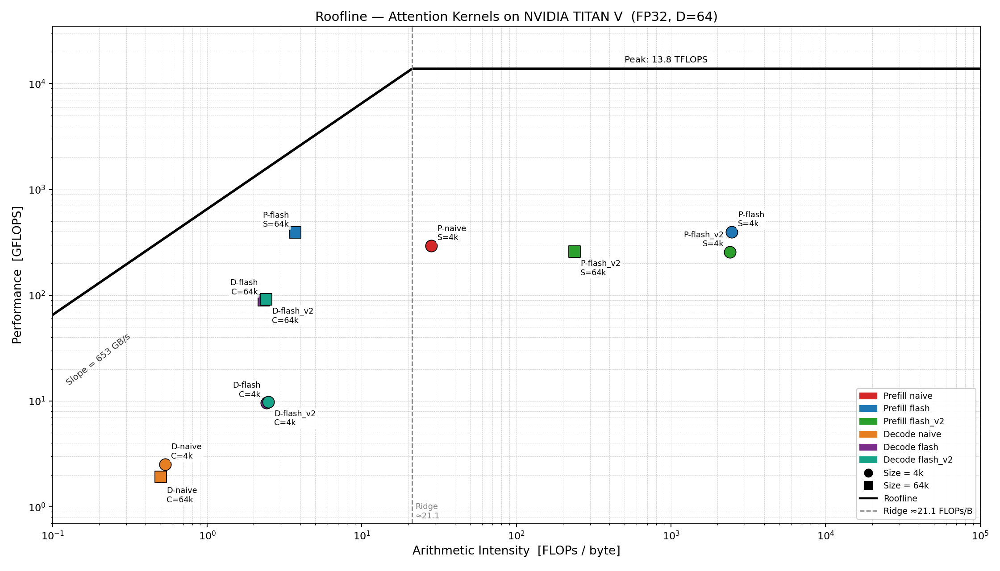

# CS259 Mini-Project 1 — Part 2: Single-Head Attention CUDA Kernels

## 1. Hardware and Theoretical Bounds

**GPU**: NVIDIA TITAN V (Volta GV100)

| Parameter | Value |
|---|---|
| FP32 peak compute | 13,800 GFLOPS (13.8 TFLOPS) |
| HBM2 peak bandwidth | 652.8 GB/s |
| L2 cache | 4.5 MB |
| SMs | 80 |
| Ridge point | 21.1 FLOPs/byte |

**Theoretical FLOPs** (D = 64, causal masking):

| Workload | Formula | Value |
|---|---|---|
| Prefill S=4096 | 2·D·S·(S+1) | 2.15 GFLOP |
| Prefill S=65536 | 2·D·S·(S+1) | 549.8 GFLOP |
| Decode C=4096 | 4·C·D | 1.05 MFLOP |
| Decode C=65536 | 4·C·D | 16.8 MFLOP |

**Theoretical arithmetic intensity** (assuming each matrix element read once):

| Workload | I_arith | Region |
|---|---|---|
| Prefill S=4096 | 537 FLOPs/byte | compute-bound |
| Prefill S=65536 | 8590 FLOPs/byte | compute-bound |
| Decode (any C) | 0.52 FLOPs/byte | memory-bound |

---

## 2. Implementation Overview

### 2.1 Prefill Kernels

**`prefill_naive`** (baseline, S ≤ 4096 only)

- Grid: (S,) — one block per query row. Block: 256 threads.
- Allocates an S×S global score buffer. For S=4096, this is 67 MB; for S=65536 it would require 17.2 GB, exceeding TITAN V's 12 GB HBM — this kernel is skipped for the large-S workload.
- Three passes: (1) dot-products → score buffer, (2) global max + exp/sum for softmax, (3) weighted V accumulation.

**`prefill_flash`** (tile = 16)

- Implements Flash Attention with online softmax, eliminating the score buffer.
- Grid: (S,), Block: D=64 threads — one thread per output dimension.
- Loads K/V in tiles of 16 rows into shared memory. For each key within a tile, the score (a dot product across all D dimensions) is reduced via `__shfl_down_sync` (intra-warp) and a two-entry shared array `swarp[2]` (cross-warp), then the running state (m, sum, out) is updated in registers using the online softmax correction formula.

**`prefill_flash_v2`** (tile = 32)

- Identical algorithm to `prefill_flash` but doubles the tile size to 32 rows.
- The 2× larger tile halves the number of outer iterations and the associated `__syncthreads()` barriers and tile-load overhead.
- Shared memory doubles to ~16 KB, reducing occupancy relative to flash (tile=16).

### 2.2 Decode Kernels

**`decode_naive`** (baseline)

- Grid: (1,) — single block with 256 threads. Maintains a global score buffer of size C.
- Three-pass softmax over all C context positions. With only one block, only one SM is used, leaving 79 of 80 SMs idle.

**`decode_flash`** (2-phase Flash Decoding, slice = 256)

- Phase 1: Each of ⌈C/256⌉ blocks processes a slice of 256 context positions using online softmax, writing local (m, d, O_partial) to global memory.
- Phase 2: A single block merges all partial results using the same online-softmax merge formula: for each partial block b, m_new = max(m, m_b), then rescale and accumulate.
- For C=65536, this launches 256 blocks — enough to saturate TITAN V's 80 SMs.

**`decode_flash_v2`** (slice = 256, float4 loads)

- Identical 2-phase structure and slice size as `decode_flash`.
- Replaces scalar K/V loads with 128-bit float4 loads, issuing one memory transaction per 4 floats. This reduces load instruction count and can improve cache line utilization.

---

## 3. Performance Results

### 3.1 Benchmark Timing

| Kernel | Size | Time (ms) | GFLOPS | Speedup vs naive |
|---|---|---|---|---|
| prefill_naive | S=4096 | 7.356 | 292.0 | 1.00× |
| prefill_flash | S=4096 | 5.444 | 394.6 | **1.35×** |
| prefill_flash_v2 | S=4096 | 8.433 | 254.7 | 0.87× |
| prefill_naive | S=65536 | — | — | N/A (OOM) |
| prefill_flash | S=65536 | 1406.6 | 390.8 | — |
| prefill_flash_v2 | S=65536 | 2128.0 | 258.4 | 0.66× vs flash |
| decode_naive | C=4096 | 0.417 | 2.52 | 1.00× |
| decode_flash | C=4096 | 0.109 | 9.66 | **3.83×** |
| decode_flash_v2 | C=4096 | 0.106 | 9.85 | **3.91×** |
| decode_naive | C=65536 | 8.700 | 1.93 | 1.00× |
| decode_flash | C=65536 | 0.186 | 90.0 | **46.8×** |
| decode_flash_v2 | C=65536 | 0.183 | 91.5 | **47.5×** |

### 3.2 NCU Profiling Data

| Kernel | Size | DRAM Read | DRAM Write | ffma count | Measured AI (FLOPs/B) | Occupancy | DRAM BW% |
|---|---|---|---|---|---|---|---|
| prefill_naive | S=4096 | 33.88 MB | 47.76 MB | 1,149M | 28.2 | 47.88% | 1.66% |
| prefill_flash | S=4096 | 3.15 MB | 1.19 MB | 5,371M | 2,475 | 29.71% | 0.12% |
| prefill_flash_v2 | S=4096 | 3.15 MB | 1.20 MB | 5,371M | 2,469 | 14.57% | 0.08% |
| prefill_flash | S=65536 | 742.72 GB | 18.21 MB | 1,374B | 3.70 | 34.08% | 80.90% |
| prefill_flash_v2 | S=65536 | 11.56 GB | 18.21 MB | 1,374B | 237 | 15.57% | 0.83% |
| decode_naive | C=4096 | 2.10 MB | 0.51 KB | 561K | 0.53 | 7.30% | 0.60% |
| decode_flash | C=4096 | 2.10 MB | 1.28 KB | 2,621K | 2.49 | 3.12% | 2.64% |
| decode_flash_v2 | C=4096 | 2.11 MB | 1.02 KB | 2,621K | 2.48 | 3.12% | 2.93% |
| decode_naive | C=65536 | 33.96 MB | 1.90 MB | 8,978K | 0.50 | 7.30% | 0.63% |
| decode_flash | C=65536 | 33.56 MB | 1.44 MB | 41,943K | 2.40 | 9.89% | 38.29% |
| decode_flash_v2 | C=65536 | 33.56 MB | 1.44 MB | 41,943K | 2.40 | 9.96% | 40.07% |

*Measured AI = (ffma_count × 2) / (DRAM_read + DRAM_write)*

---

## 4. Analysis

### 4.1 Prefill — correctness of flash attention

Standard attention for S=65536 requires storing the full S×S score matrix:
65536² × 4 bytes = **17.2 GB**, which exceeds TITAN V's 12 GB HBM.
Flash Attention processes K and V in tiles and maintains only a scalar running state (m, d, out) per thread, requiring O(tile · D) shared memory regardless of S. This makes arbitrarily long sequences feasible.

### 4.2 Prefill — compute-bound vs memory-bound (the key finding)

**S=4096 — compute-bound**

Both `prefill_flash` and `prefill_flash_v2` show measured AI ≈ 2,470 FLOPs/byte, far above the ridge point of 21.1. DRAM throughput is below 0.12%; essentially all data lives in L1/L2 cache or registers. Performance is limited by compute throughput:

- `prefill_flash`: sm__throughput = 57.5%, occupancy = 29.7% → 395 GFLOPS (2.9% of FP32 peak). The online softmax dependency chain (m, corr, es, s, o each depend on the previous step) limits instruction-level parallelism.
- `prefill_flash_v2`: occupancy drops to 14.6% because the shared memory doubles from 8.2 KB to 16.4 KB per block, halving the blocks-per-SM. sm__throughput falls to 36.3% → 255 GFLOPS. The benefit of the larger tile (fewer barrier syncs) is outweighed by the occupancy penalty.

**S=65536 — memory-bound despite identical algorithm**

This is the most instructive finding. `prefill_flash` achieves 391 GFLOPS at S=65536, nearly identical to its S=4096 performance in absolute GFLOPS. Yet the bottleneck is completely different:

- DRAM throughput = **80.9%** of peak (528 GB/s measured)
- DRAM read = 742.72 GB (vs only 3.15 MB at S=4096!)

Why? Flash attention processes S=65536 query rows sequentially. For query row i, it must read K[0..i] and V[0..i] from global memory. Key j is accessed by queries j, j+1, …, S-1 — on average S/2 ≈ 32,768 times. The total K+V reads = ~S²/2 × 2 × D × 4 bytes ≈ 1.1 TB, far exceeding the 4.5 MB L2 cache. Every tile read is a cold miss, and performance is limited by HBM bandwidth.

The measured AI drops from a theoretical 8,590 FLOPs/byte (assuming each element read once) to just **3.70 FLOPs/byte** in practice — below the ridge point. The kernel is memory-bound.

**S=65536, flash_v2: cache efficiency vs occupancy tradeoff**

`prefill_flash_v2` at S=65536 shows a striking contrast:
- DRAM read = only **11.56 GB** (vs 742.72 GB for flash) — 64× less DRAM traffic.
- The 2× larger tile provides temporal locality: when block i+1 loads the same K/V tile as block i used last, that tile is often still in L2 cache. The larger tile amortizes the cold-miss cost over more queries.
- Yet performance is **worse** (258 GFLOPS vs 391 GFLOPS), because occupancy drops from 34% to 16% due to doubled shared memory. With fewer warps to hide latency, the SM stalls more on the exp() and online softmax dependency chain.
- sm__throughput = 36.96% vs 56.83%. Even though DRAM is no longer the bottleneck for flash_v2, the compute pipeline is underutilized.

### 4.3 Decode — memory-bound, multi-block parallelism is key

All decode kernels show AI ≈ 0.5–2.4 FLOPs/byte, far below the ridge point. Decode is fundamentally memory-bound: there is only one query vector, so the arithmetic is trivial compared to the cost of reading the entire KV cache from HBM.

**decode_naive**: Grid = (1,) — single block, single SM. For C=65536, DRAM throughput = 0.63% despite the kernel being memory-bound! A single block with 256 threads can only issue a limited number of outstanding memory requests, leaving 99.4% of HBM bandwidth unused. This is the classic serial bottleneck.

**decode_flash (Flash Decoding)**: Launches ⌈C/256⌉ = 256 blocks for C=65536, using up to 256 SM slots simultaneously. DRAM throughput rises to **38.3%** and performance improves **46.8×** over naive. The multi-block approach allows many memory transactions to be in flight concurrently, far better utilizing HBM.

**decode_flash_v2 (+ float4)**: Same slice size (256 positions per block) as flash, so the same 256 blocks launch. The float4 loads slightly increase the L1-texture bytes (98.71 MB vs 33.70 MB), indicating better cache line packing. DRAM throughput rises marginally to **40.1%**, yielding a small but consistent improvement: **91.5 vs 90.0 GFLOPS** for C=65536.

All decode kernels are severely below DRAM peak (40% best case). The root cause is the small problem size: even 256 blocks with 64 threads = 16,384 threads cannot saturate 80 SMs × ~2048 warps = 160K concurrent threads. Occupancy peaks at ~10%.

### 4.4 Why optimizations sometimes fail

| Optimization | Expectation | Actual outcome | Root cause |
|---|---|---|---|
| prefill_flash_v2: tile 16→32 | Fewer outer iterations, faster | Slower at S=4096 | smem 8→16 KB, occupancy 30→15% |
| prefill_flash_v2 at S=65536 | Better cache reuse | Still slower | Lower occupancy outweighs cache gains |
| decode_flash_v2: float4 | More efficient loads | Marginal (+1.7%) at C=65536 | Already memory-bound; float4 helps little when BW is the wall |
| decode_flash_v2 at C=4096 | Same or faster | Same (≈ 9.85 vs 9.66) | Problem too small to see difference |

---

## 5. Roofline Summary

| Kernel | Measured AI | Bottleneck | % of roofline |
|---|---|---|---|
| prefill_naive S=4096 | 28.2 FLOPs/B | compute (near ridge) | 292/13800 = 2.1% |
| prefill_flash S=4096 | 2,475 FLOPs/B | compute (deep) | 395/13800 = 2.9% |
| prefill_flash_v2 S=4096 | 2,469 FLOPs/B | compute, low occupancy | 255/13800 = 1.8% |
| prefill_flash S=65536 | 3.70 FLOPs/B | **HBM bandwidth** | 391/(652.8×3.70) = 16.2% |
| prefill_flash_v2 S=65536 | 237 FLOPs/B | compute, low occupancy | 258/13800 = 1.9% |
| decode_naive C=65536 | 0.50 FLOPs/B | HBM, single block | 1.93/(652.8×0.50) = 0.59% |
| decode_flash C=65536 | 2.40 FLOPs/B | HBM, multi-block | 90/(652.8×2.40) = 5.7% |
| decode_flash_v2 C=65536 | 2.40 FLOPs/B | HBM, multi-block | 91.5/(652.8×2.40) = 5.8% |

All kernels remain well below theoretical peak. The primary reasons are:

1. **Online softmax serial dependency**: m → corr → es → s → o is a 5-step chain that cannot be pipelined, limiting instruction-level parallelism.
2. **Low occupancy for flash_v2**: 16 KB shared memory limits blocks-per-SM, reducing latency hiding.
3. **Decode inherently underutilizes hardware**: One query against a KV cache is too small a problem for 80 SMs; even with 256 blocks, thread count is ~5% of full GPU capacity.
4. **HBM reuse problem at large S**: Flash attention must re-read K/V for every query row; the working set exceeds all cache levels at S=65536.

---

## 6. Conclusion

Flash Attention is indispensable for large prefill sequences: standard attention requires 17.2 GB for S=65536, exceeding hardware limits, while flash attention operates with O(tile × D) shared memory regardless of S. At S=4096, flash attention achieves 1.35× speedup over naive by eliminating the score buffer and reducing DRAM traffic from 81.6 MB to 4.3 MB; the workload is compute-bound at 2.9% of FP32 peak, limited by the online softmax dependency chain. At S=65536, the bottleneck shifts to HBM bandwidth (80.9% utilization) because K and V must be re-read from DRAM for every query row, accumulating 742 GB of total data movement despite each matrix being only 16 MB.

For decode, multi-block Flash Decoding provides 47× speedup by parallelizing across slices of the KV cache, raising DRAM throughput from 0.6% (naive, single block) to 40% (flash_v2, 256 blocks). Both tasks remain far from hardware limits, suggesting that further improvements would require warp-level pipeline hiding of the softmax dependency chain or tensor-core utilization (FP16/BF16).