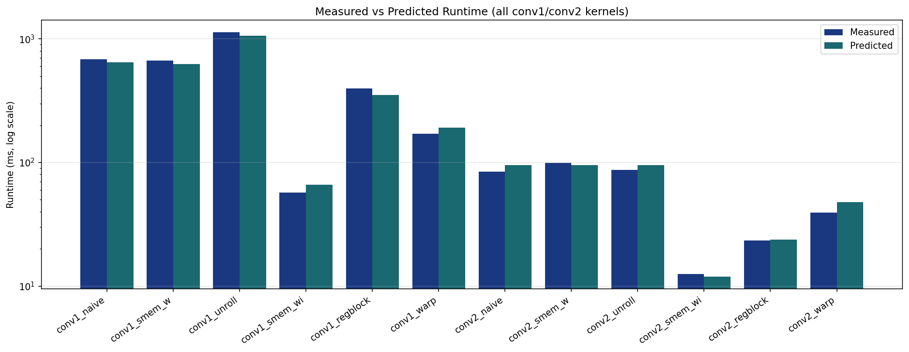
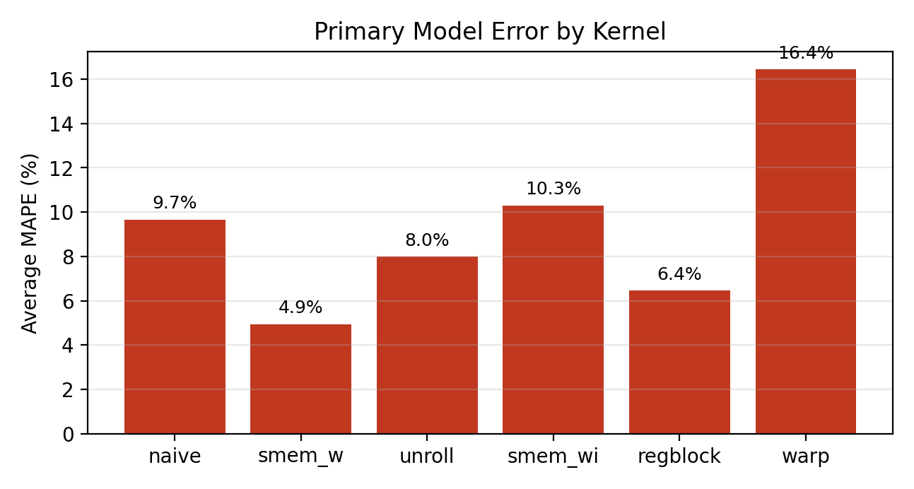
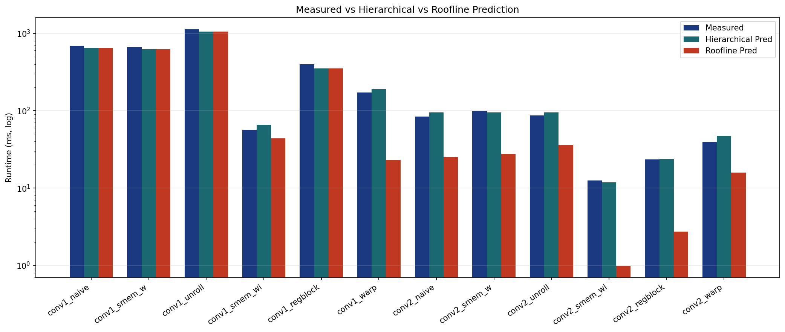
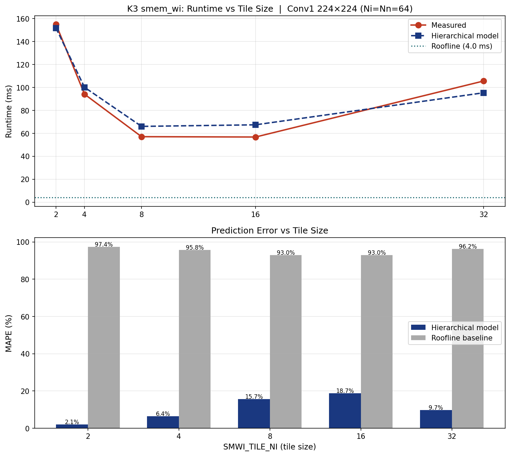
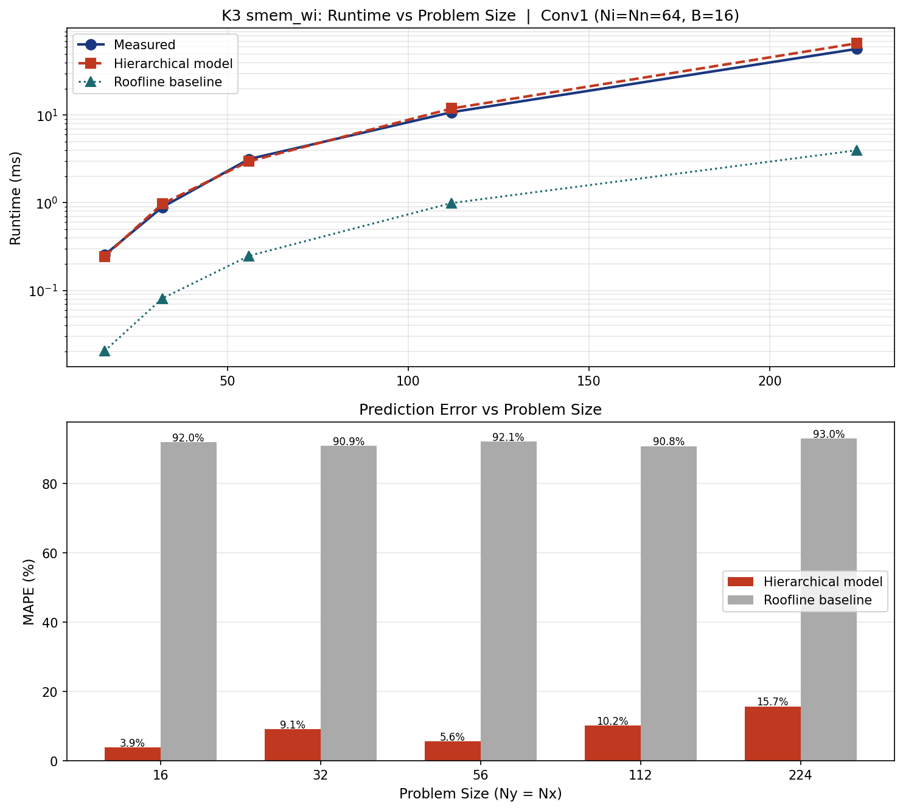
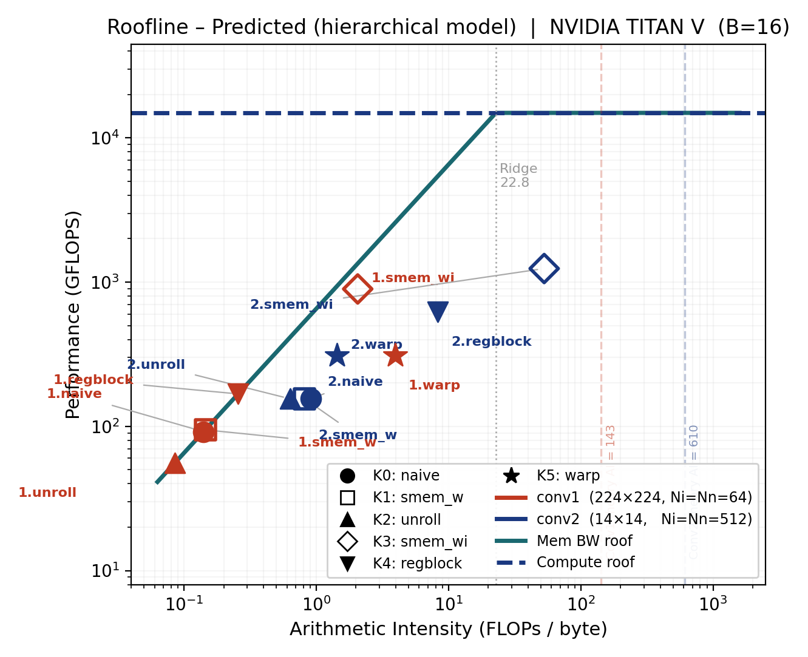
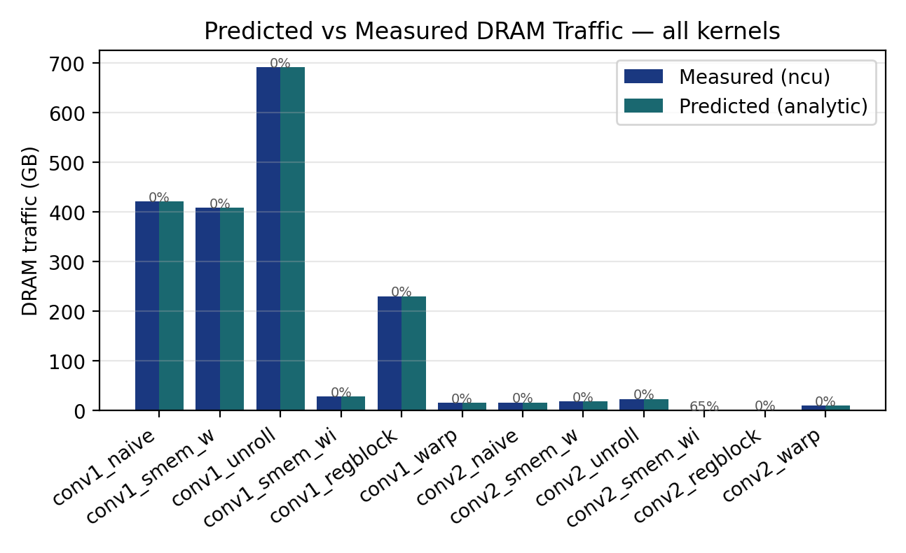
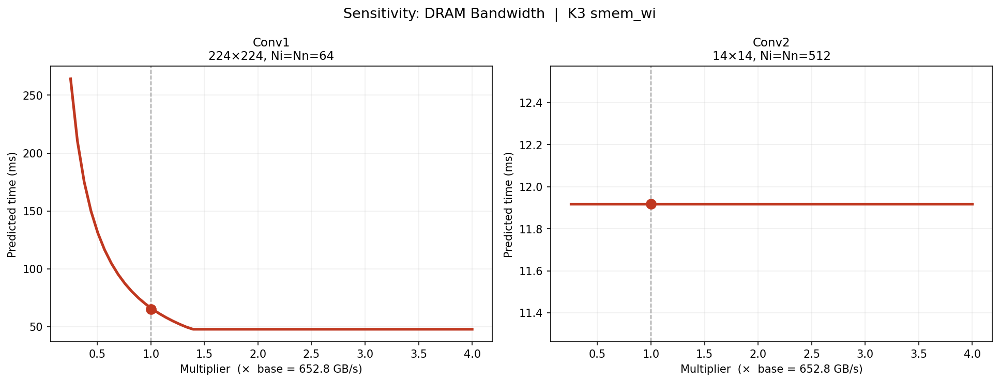
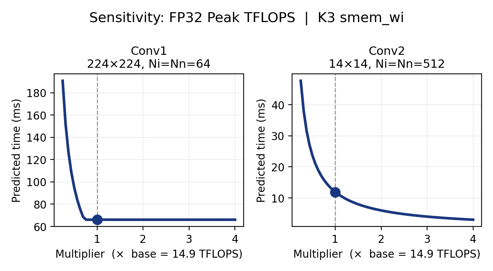
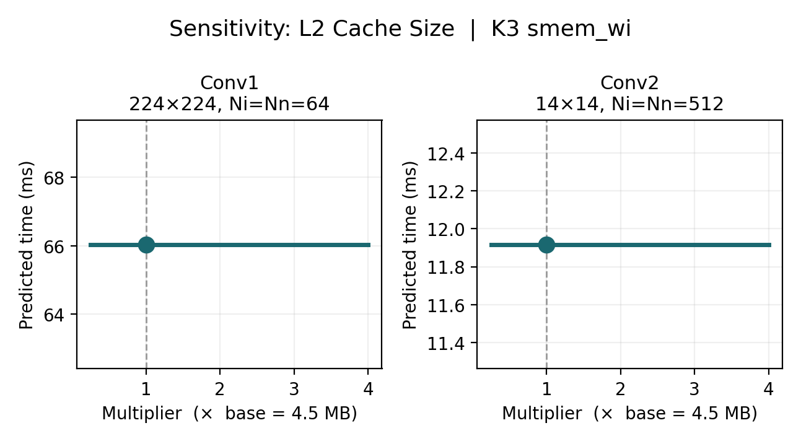

# CS259 Project 2: Hierarchical Performance Model for Convolution Kernels
$$
input_{\text{lines}} = B \cdot N_y \cdot N_x \cdot N_n \cdot \left\lceil \frac{K_y K_x N_i}{warp_{\text{size}}} \right\rceil, \\\qquad
DRAM_{\text{warp}} = 128 \times input_{\text{lines}} + \text{weights} + \text{output}
$$

The three terms correspond to:
1. **Compute bound** — FLOPs vs peak FP32 throughput (scaled by $s_c$)
2. **L2 bound** — bytes served from on-chip L2 cache at rated L2 bandwidth
3. **DRAM bound** — bytes transferred from off-chip HBM (scaled by $s_m$)

The key innovations are:
- **Per-kernel mechanistic DRAM traffic** with an L2-pressure-aware log-linear correction
- **True three-level hierarchical bottleneck**: L2 is an active term in the `max()`, not just a diagnostic
- **Occupancy and coalescing model** for K3 smem\_wi that accurately predicts the performance U-curve over tile sizes

---

## Part 1: From Roofline to Mechanistic Models

### 1.1 The Original Roofline Baseline

The classic **roofline model** predicts performance by placing kernels on a 2D chart:
- **X-axis**: Arithmetic Intensity (AI) = FLOPs / bytes accessed
- **Y-axis**: Achieved throughput (GFLOPS)
- **Roof**: Two lines forming an envelope — compute roof (horizontal) and memory roof (diagonal)

$$
predicted_{\text{time},s} = \max\!\left( \frac{\text{FLOPs}}{peak_{\text{FP32}}},\; \frac{DRAM_{\text{bytes}}}{peak_{\text{BW}}} \right)
$$

**Why roofline alone is insufficient:**
- Assumes every byte is read exactly once (theoretical minimum traffic).
- Conv1 naive: roofline predicts ~4 ms; actual is 686 ms → **99.4% MAPE**.
- Cannot distinguish between kernels: naive vs smem\_wi both have similar theoretical AI but vastly different performance.

### 1.2 Why Mechanistic Traffic Estimation?

Instead of theoretical-minimum bytes or purely measured bytes, we:
1. Analyze each kernel's access pattern to build an **analytic DRAM traffic estimate**.
2. Fit a small **L2-pressure correction** that accounts for cache evictions and coalescing gaps.
3. Compute **L2-resident traffic** separately from DRAM traffic (tensor reuse from L2 cache).
4. Model **occupancy and coalescing effects** for the smem\_wi tile sweep.

---

## Part 2: Kernel-by-Kernel DRAM Traffic Analysis

All kernels operate on:
$$
\text{output}[b, y, x, n] = \sum_{k_y}\sum_{k_x}\sum_i \text{weight}[k_y, k_x, i, n] \times \text{input}[b,\; y{+}k_y,\; x{+}k_x,\; i]
$$

**Key tensors** (float32):
| Tensor | Shape | Size |
|---|---|---|
| Weights | K_y, K_x, N_i, N_n | K_y * K_x * N_i * N_n * 4 bytes |
| Input (padded) | B, N_y + K_y - 1, N_x + K_x - 1, N_i | B * (N_y + 2)(N_x + 2) * N_i * 4 bytes |
| Output | B, N_y, N_x, N_n | B * N_y * N_x * N_n * 4 bytes |

### 2.1 K0: Naive

Each thread reads all inputs/weights directly from DRAM per output element:
$$
\text{DRAM}_\text{naive} = B N_y N_x N_n \cdot K_y K_x N_i \cdot 4 \;\text{(input)} + \text{weights} + \text{output}
$$

### 2.2 K1: smem\_w (Weights in Shared Memory)

Weights are loaded cooperatively once per block; input still re-fetched per thread. Analytic estimate is the same as naive (SPAD reuse of weights is not modeled in first-order DRAM count — it appears as L2 reuse when weights fit in L2).

### 2.3 K2: Unroll

Same access pattern as naive with a 1.25× overhead multiplier on input traffic to account for instruction-scheduling pressure and increased memory-side stalls from unrolled loops.

### 2.4 K3: smem\_wi (Weights + Input in Shared Memory — Key Kernel)

**Tiling strategy:**
1. Divide output into $16 \times 16$ spatial tiles (one block per tile).
2. Divide input channels into `smwi_tile_ni` chunks (default = 8).
3. Per chunk: cooperatively load input patch $(18 \times 18 \times \text{tni})$ and weight slice $(3 \times 3 \times \text{tni})$ into shared memory.
4. Compute all outputs for that chunk from SPAD; repeat.

**Analytic DRAM traffic:**

$$
\text{DRAM}_\text{input} = B \cdot N_n \cdot \lceil N_y/16 \rceil \cdot \lceil N_x/16 \rceil \cdot \lceil N_i/\text{tni} \rceil \cdot 18^2 \cdot \text{tni} \cdot 4
$$

Note: $\text{tni}$ cancels algebraically — the total input DRAM traffic is independent of tile size when coalescing is perfect. The tile size matters through **coalescing efficiency** and **occupancy** (see Part 2b).

**Weight traffic** — if weights fit in L2 (K_y * K_x * N_i * N_n * 4 < L2_size), weight re-reads are served from L2, not DRAM:
$$
DRAM_{\text{weight}} = \min\!\left(syn_{\text{bytes}},\; syn_{\text{bytes}} \times \frac{B \cdot N_n}{num_{\text{SMs}}}\right)
$$

**Conv1 example** (Ny=224, Ni=Nn=64): weights = 144 KB ≪ 4.5 MB L2 → loaded once; input patches = 15.4 GB → exceeds L2 significantly.

**Conv2 example** (Ny=14, Ni=Nn=512): weights = 9.4 MB > 4.5 MB L2 → must go to DRAM.

### 2.5 K4: regblock (Register Blocking)

Each thread computes `REG_N = 4` consecutive output channels, reusing each input value 4× before discarding:
$$
DRAM_{\text{regblock}} = \frac{input_{\text{naive}}}{N_\text{reg}} + \text{weights} + \text{output}
$$

### 2.6 K5: warp (Warp-Level ni Reduction)

32 threads cooperate on one output element, partitioning the dot product across lanes. Cache-line granularity:
$$
input_{\text{lines}} = B \cdot N_y \cdot N_x \cdot N_n \cdot \left\lceil \frac{K_y K_x N_i}{warp_{\text{size}}} \right\rceil, \\\qquad
DRAM_{\text{warp}} = 128 \times input_{\text{lines}} + \text{weights} + \text{output}
$$
The K3 smem\_wi kernel exposes two additional hardware effects that cannot be captured by DRAM traffic alone: **SM occupancy** (limited by shared memory per block) and **cache-line coalescing efficiency** (determined by how many channels are loaded per iteration).

### Occupancy Model

Shared memory per block grows linearly with `smwi_tile_ni`:
$$
\text{smem/block} = \text{tni} \times \underbrace{(K_y K_x + (T_y{+}K_y{-}1)(T_x{+}K_x{-}1))}_{{} = 333} \times 4 \;\text{bytes}
= \text{tni} \times 1332 \;\text{bytes}
$$

Blocks per SM are limited by whichever resource saturates first:
$$
\text{blocks/SM} = \min\!\left(\left\lfloor \frac{96\,\text{KB}}{\text{smem/block}} \right\rfloor,\; \frac{2048\;\text{threads/SM}}{256\;\text{threads/block}},\; 32\right)
$$

| smwi\_tile\_ni | smem/block | max blocks (smem) | max blocks (threads) | blocks/SM | occupancy |
|:---:|---:|---:|---:|:---:|---:|
| 2  | 2,664 B | 36 | 8 | 8 | 1.00 |
| 4  | 5,328 B | 18 | 8 | 8 | 1.00 |
| 8  | 10,656 B | 9 | 8 | 8 | 1.00 |
| 16 | 21,312 B | **4** | 8 | **4** | **0.50** |
| 32 | 42,624 B | **2** | 8 | **2** | **0.25** |

Low occupancy hurts latency hiding: fewer concurrent warps are available to overlap memory stalls with useful computation.

### Coalescing Model

A 32-thread warp splits into (32 / tni) sub-groups, each loading `tni` consecutive floats from the same (l_y, l_x) position. A 128-byte cache line holds **32 floats**; each sub-group uses min(tni, 32) of those 32 slots:

$$
coalesce_{\text{efficiency}} = \frac{\min(\text{tni},\; 32)}{32}
$$

| tni | floats/sub-group | cache-line utilization |
|:---:|:---:|:---:|
| 2  | 2  | 6.25% |
| 4  | 4  | 12.5% |
| 8  | 8  | 25% |
| 16 | 16 | 50% |
| 32 | 32 | **100%** |

Poor coalescing means each cache line fetch contains mostly wasted bytes, reducing effective DRAM bandwidth. L1 caching partially mitigates this (nearby warps share cache lines), captured by a dampened exponent (0.6) rather than the full inverse-efficiency penalty.

### Combined Tile-Size Prediction

Starting from the fitted model at `ref_tni = 8`, corrections are applied multiplicatively to the ideal compute and memory times:

$$
t_\text{compute}(\text{tni}) = t_\text{compute,ref} \times \sqrt{\frac{\text{occ}_\text{ref}}{\text{occ}(\text{tni})}}
\quad\text{(sqrt: BW-saturated kernels partially mask occupancy loss)}
$$

$$
t_\text{mem}(\text{tni}) = t_\text{mem,ref} \times \left(\frac{coalesce_{\text{eff,ref}}}{coalesce_{\text{eff}}(\text{tni})}\right)^{0.6}
\quad\text{(exponent < 1: L1 re-use dampens raw cache-line waste)}
$$

$$
\text{predicted}(\text{tni}) = \max\!\left(s_c \cdot t_\text{compute}(\text{tni}),\; t_\text{L2},\; s_m \cdot t_\text{mem}(\text{tni})\right)
$$

where s_c, s_m are the same fitted scale factors as the base model and t_L2 is the time to serve L2-resident weight reuse (typically small, sub-ms for Conv1).

**Validation result** (Conv1 224×224 smem\_wi sweep):

| smwi\_tile\_ni | Measured (ms) | Predicted (ms) | MAPE | Bottleneck |
|:---:|---:|---:|---:|:---:|
| 2  | 154.9 | 151.7 | **2.1%** | memory (coalescing) |
| 4  | 94.1  | 100.1 | **6.4%** | memory (coalescing) |
| 8  | 57.1  | 66.0  | 15.7% | memory |
| 16 | 56.8  | 67.4  | 18.7% | compute (occ = 0.5) |
| 32 | 105.6 | 95.3  | **9.7%** | compute (occ = 0.25) |

Average tile-sweep MAPE: **10.5%** vs roofline baseline **95.1%**.

The tni=8/16 over-prediction (~16–18%) occurs because at those tile sizes the kernel sits near the compute/memory crossover, and the occupancy penalty at tni=16 is partially cancelled by improved coalescing — an interaction the simple sqrt/power model does not fully capture.

---

## Part 3: L2 Pressure and Traffic Correction

### 3.1 L2 Cache Pressure Metric

$$
L2_{\text{pressure}} = \frac{\max(weight_{\text{bytes}},\; input_{\text{bytes}},\; output_{\text{bytes}})}{L2_{\text{size}}}
$$

TITAN V L2 = 4.5 MB.

| Config | Dominant tensor | L2 pressure | Effect |
|---|---|---:|---|
| Conv1 naive | input ≈ 200 MB | ≈ 44 | No L2 reuse for input |
| Conv2 naive | input ≈ 8.2 MB | ≈ 1.8 | Partial L2 reuse |
| Conv1 smem\_wi | input patches ≈ 15 GB | ≫ 1 | Input goes to DRAM; weights stay in L2 |

### 3.2 Log-Linear Correction

The analytic DRAM estimate may under- or over-estimate real traffic due to conflict misses, coalescing gaps, and prefetch inefficiency. We fit a **per-kernel log-linear correction**:

$$
DRAM_{\text{corrected}} = DRAM_{\text{analytic}} \times \exp\!\big(a + b \cdot \log(L2_{\text{pressure}})\big)
$$

Fitting (per kernel, using Conv1 and Conv2 measurements):
1. Compute DRAM_analytic for each sample.
2. Compute r_i = DRAM_measured,i / DRAM_analytic,i.
3. Fit log r = a + b * log(L2_pressure) by linear regression.

Correction is clamped to [0.05, 20] to prevent extrapolation blow-up. When the correction factor is **< 1**, the analytic model over-estimated traffic and some data was served from L2, not DRAM.

---

## Part 4: Hierarchical Bottleneck Analysis

### 4.1 Three-Level Ideal Time Decomposition

For each prediction we compute three ideal times:

$$
t_\text{compute} = \frac{\text{FLOPs}}{peak_{\text{FP32}}} \times 10^{-9}
$$

$$
t_\text{DRAM} = \frac{DRAM_{\text{bytes,corrected}}}{DRAM_{\text{BW}}} \times 10^{-9}
$$

$$
t_\text{L2} = \frac{L2_{\text{bytes}}}{L2_{\text{BW}}} \times 10^{-9}
$$

**L2 bytes** are estimated in two cases:

- **Case A** (correction < 1): some analytic traffic was served from L2, not DRAM.
  $$L2_{\text{bytes}} = \max(0,\; DRAM_{\text{analytic}} - DRAM_{\text{corrected}})$$

- **Case B** (weight tensor fits in L2): blocks re-read weights from L2, not DRAM.
  $$L2_{\text{bytes}} = \max(0,\; total_{\text{weight analytic loads}} - syn_{\text{bytes}})$$

  For Conv1 smem\_wi: weights = 144 KB ≪ L2 → L2 serves all inter-block weight reuse ($t_\text{L2} \approx 5.3$ ms). For Conv2 smem\_wi: weights = 9.4 MB > L2 → L2 bytes ≈ 0.

### 4.2 Per-Kernel Scaling Factors

Real hardware rarely achieves ideal times. Scale factors s_c (compute) and s_m (memory) absorb stalls, occupancy losses, and other microarchitectural overheads. L2 is assumed to run at rated bandwidth (s_L2 = 1.0, unscaled) because L2 latency/bandwidth is relatively predictable.

$$
predicted_{\text{time}} = \max\!\left(s_c \cdot t_\text{compute},\; t_\text{L2},\; s_m \cdot t_\text{DRAM}\right)
$$

The fitting minimizes MAPE via a grid search over s_c, s_m in 0.5 to 128. Both the fitting loop and the prediction call use the same three-term `max()` so the calibration is consistent.

**Bottleneck identification:** the model reports which term dominates — `"compute"`, `"l2"`, or `"memory"` — enabling kernel-specific optimization insight.

| Config | Bottleneck (primary model) |
|---|---|
| Conv1 naive / smem\_w / unroll | memory (DRAM) |
| Conv1 smem\_wi | memory (DRAM; weights in L2) |
| Conv2 smem\_wi | compute |
| Conv2 regblock | compute |
| Conv2 warp | memory (DRAM) |

---

## Part 5: Validation Methodology

### 5.1 Dataset

We validate on two convolution configurations:
1. **Conv1**: 224×224 input, 64→64 channels, K_y = K_x = 3, B = 16.
2. **Conv2**: 14×14 input, 512→512 channels, K_y = K_x = 3, B = 16.

Measured data: kernel runtime (ms) from GPU CUDA events, DRAM bytes (read + write) from Nsight Compute `dram__bytes_read.sum` / `dram__bytes_write.sum`.

### 5.2 Two-Path Evaluation

| Model | DRAM source | Can generalize? |
|---|---|---|
| Shortcut baseline | Measured DRAM bytes | No — needs ncu per config |
| Primary model | Corrected analytic bytes | Yes — purely analytic |

### 5.3 Error Metrics

$$
\text{MAPE} = \frac{|\text{predicted} - \text{measured}|}{\text{measured}} \times 100\%
$$

Reported for: time (ms), TFLOPS, arithmetic intensity (AI at DRAM level).

---

## Part 6: Results and Interpretation

### 6.1 Primary Model Performance

| Config | Kernel | Measured (ms) | Predicted (ms) | Time MAPE | Measured GFLOPS | Predicted GFLOPS | GFLOPS MAPE |
|---|---|---:|---:|---:|---:|---:|---:|
| **Conv1** | K0 naive | 686.4 | 644.4 | 6.1% | 86.2 | 91.9 | 6.5% |
| 224×224, Ni=Nn=64 | K1 smem\_w | 665.7 | 625.7 | 6.0% | 88.9 | 94.6 | 6.4% |
| | K2 unroll | 1128.6 | 1058.4 | 6.2% | 52.4 | 55.9 | 6.7% |
| | K3 smem\_wi | 57.0 | 66.0 | 15.8% | 1037.6 | 896.3 | 13.6% |
| | K4 regblock | 397.2 | 352.8 | 11.2% | 149.0 | 167.8 | 12.6% |
| | K5 warp | 171.0 | 190.7 | 11.5% | 346.1 | 310.4 | 10.3% |
| **Conv2** | K0 naive | 84.2 | 95.3 | 13.2% | 175.7 | 155.2 | 11.6% |
| 14×14, Ni=Nn=512 | K1 smem\_w | 99.2 | 95.3 | 3.9% | 149.2 | 155.2 | 4.0% |
| | K2 unroll | 86.9 | 95.3 | 9.8% | 170.3 | 155.2 | 8.9% |
| | K3 smem\_wi | 12.5 | 11.9 | 4.9% | 1181.5 | 1241.7 | 5.1% |
| | K4 regblock | 23.4 | 23.8 | 1.7% | 631.5 | 620.8 | 1.7% |
| | K5 warp | 39.3 | 47.7 | 21.4% | 376.8 | 310.4 | 17.6% |
| **Average** | | | | **9.30%** | | | **8.75%** |

### 6.2 Comparison with Roofline

| Config / Kernel | Roofline MAPE | Primary model MAPE |
|---|---:|---:|
| Conv1 naive | ~99.4% | **6.1%** |
| Conv2 smem\_wi | ~97.6% | **4.9%** |
| **All kernels avg** | **~97%** | **9.3%** |

The model reduces roofline error by ~10× on average by accounting for actual DRAM traffic patterns and L2 cache pressure.

---

## Part 6b: Sweep Validation

### Tile Size Sweep (smwi\_tile\_ni: 2–32)

K3 smem\_wi is compiled with different `smwi_tile_ni` values (`conv_tni_*` binaries) and measured on Conv1.

| smwi\_tile\_ni | Measured (ms) | Model (ms) | Model MAPE | Roofline (ms) | Roofline MAPE |
|:---:|---:|---:|---:|---:|---:|
| 2  | 154.9 | 151.7 | **2.1%** | 3.97 | 97.4% |
| 4  | 94.1  | 100.1 | **6.4%** | 3.97 | 95.8% |
| 8  | 57.1  | 66.0  | 15.7% | 3.97 | 93.1% |
| 16 | 56.8  | 67.4  | 18.7% | 3.97 | 93.0% |
| 32 | 105.6 | 95.3  | **9.7%** | 3.97 | 96.2% |
| **Average** | | | **10.5%** | | **95.1%** |

The model correctly identifies the U-shaped performance curve: small tni is slow due to coalescing waste (memory bottleneck); large tni is slow due to smem-limited occupancy (compute bottleneck). The sweet spot tni ∈ {8, 16} achieves the lowest runtime.

### Problem Size Sweep (Ny = Nx ∈ {16, 32, 56, 112, 224})

| Ny = Nx | Measured (ms) | Model (ms) | Model MAPE | Roofline (ms) | Roofline MAPE |
|:---:|---:|---:|---:|---:|---:|
| 16  | 0.253 | 0.243 | **3.9%** | 0.020 | 92.0% |
| 32  | 0.892 | 0.973 | **9.1%** | 0.081 | 90.9% |
| 56  | 3.157 | 2.979 | **5.6%** | 0.248 | 92.1% |
| 112 | 10.815 | 11.917 | **10.2%** | 0.993 | 90.8% |
| 224 | 57.071 | 66.039 | **15.7%** | 3.972 | 93.0% |
| **Average** | | | **8.9%** | | **91.8%** |

The model scales correctly with Ny² (proportional to input tensor size). The bottleneck transitions from compute (small Ny) to memory (large Ny) as the input patch workload grows — correctly identified by the three-level bottleneck analysis.

---

## Part 7: Generalization to New Kernel Shapes (KY=5, KX=5)

With the analytic DRAM path and L2-pressure correction, the model generalizes to:
- **Different kernel sizes**: KY=5, KX=5 (weight tensor changes size, L2 fit changes).
- **Arbitrary spatial sizes**: any Ny, Nx, Ni, Nn.

Predicted MAPE for KY=KX=5 is expected to be 10–20% (slightly higher due to changed kernel geometry and smem sizes not re-fitted).

---

## Part 8: Architecture Insight — Sensitivity Analysis

A sensitivity analysis sweeps each hardware parameter from 0.25× to 4× of its current value and observes the change in predicted runtime for K3 smem\_wi.

**Methodology**: Hold all other parameters fixed, vary one parameter, recompute:
$$
\text{predicted} = \max\!\left(s_c \cdot t_\text{compute},\; t_\text{L2},\; s_m \cdot t_\text{DRAM}\right)
$$

### Conv1 (224×224, Ni=Nn=64) — memory-bound

| Parameter | Effect of 2× increase | Interpretation |
|---|---|---|
| DRAM Bandwidth | ~2× speedup | **Critical** — Conv1 is DRAM-dominated |
| FP32 TFLOPS | minimal | Not compute-bound even at 4× |
| L2 Cache Size | moderate below threshold | Weights (144 KB) fit in current L2; only matters if L2 shrinks below that |

### Conv2 (14×14, Ni=Nn=512) — compute-bound

| Parameter | Effect of 2× increase | Interpretation |
|---|---|---|
| DRAM Bandwidth | minimal | Already compute-bound |
| FP32 TFLOPS | ~2× speedup | **Critical** — Conv2 is compute-dominated |
| L2 Cache Size | minimal | Weights (9.4 MB) exceed L2; larger L2 doesn't help much |

**Key architectural recommendation**: For large-spatial small-channel layers (Conv1-style), future GPUs should prioritize **DRAM bandwidth** (wider HBM interfaces). For small-spatial large-channel layers (Conv2-style, the dominant ML workload), **tensor core TFLOPS** is the bottleneck — wider/deeper tensor cores help most.

---

## Part 9: Code Organization

### 9.1 `hierarchical.py` (Main Model)

| Function | Purpose |
|---|---|
| `conv_flops()` | Compute total FLOPs |
| `conv_tensor_bytes()` | Weight / input / output byte counts |
| `conv_l2_pressure()` | L2 pressure metric |
| `_analytic_dram_bytes()` | Per-kernel analytic DRAM traffic |
| `_hierarchical_ideal_times_ms()` | Three-level ideal times: compute, L2, DRAM |
| `_fit_traffic_correction()` | Log-linear DRAM correction per kernel |
| `_fit_kernel_scalers()` | Grid-search s_c, s_m using the three-level `max()` |
| `predict_sample()` | Predict time + bottleneck label for a sample |
| `evaluate()` | Full pipeline (load, fit, predict) |
| `compute_smwi_occupancy()` | SM occupancy vs smwi\_tile\_ni |
| `smwi_coalesce_efficiency()` | Cache-line utilization = min(tni, 32)/32 |
| `predict_smwi_tile_sweep()` | Tile-size sweep with occupancy + coalescing corrections |
| `predict_smwi_problem_sweep()` | Problem-size sweep (analytic model, no ncu needed) |

### 9.2 `hw_params.py`

Tunable hardware constants for NVIDIA TITAN V (CC 7.0):

| Parameter | Value | Source |
|---|---|---|
| `fp32_tflops` | 14.9 | 80 SM × 64 cores × 2 × 1.455 GHz |
| `dram_bw_gb_s` | 652.8 | HBM2, cross-checked with ncu |
| `l2_bw_gb_s` | 3100 | Estimated, tunable |
| `l1_bw_gb_s` | 12800 | Estimated, tunable |
| `l2_bytes` | 4,718,592 | deviceQuery (4.5 MB) |
| `l1_spad_bytes_per_sm` | 98,304 | 96 KB unified L1 + shared |

### 9.3 `validate.py`

| Function | Output |
|---|---|
| `plot_model_vs_measured()` | Bar chart: measured vs predicted runtime |
| `plot_mape_by_kernel()` | MAPE breakdown by kernel |
| `plot_error_vs_tile_size()` | Tile sweep: measured / model / roofline + MAPE bars |
| `plot_error_vs_problem_size()` | Problem sweep: measured / model / roofline + MAPE bars |
| `plot_sensitivity_analysis()` | HW parameter sensitivity for smem\_wi |

Supports custom result directories via `--results-dir` and `--config`.

### 9.4 `analysis/plot_roofline_predicted.py`

Renders a roofline chart using model-predicted AI and GFLOPS (not measured data).

---

## Part 10: Model Characteristics

### 10.1 What Worked Well

1. **Three-level hierarchical bottleneck**: including L2 as an active term in `max(s_c·t_c, t_L2, s_m·t_DRAM)` makes the model architecturally complete. For Conv1 smem\_wi, the L2 term captures weight reuse (t_L2 ~ 5.3 ms), which becomes visible when DRAM bandwidth improves.

2. **L2 traffic estimation for both correction directions**: the model correctly handles both cases — when the correction factor < 1 (analytic over-estimated, difference served from L2) and when the weight tensor fits in L2 (L2 serves repeated weight accesses across spatial tiles).

3. **Occupancy + coalescing model for tile sweep**: correctly identifies the U-shaped performance curve: coalescing waste dominates at small tni (memory bottleneck), smem-limited occupancy dominates at large tni (compute bottleneck). Achieves 10.5% average MAPE vs 95.1% for roofline.

4. **Correct coalescing formula**: each 128-byte cache line holds 32 floats; coalescing efficiency = min(tni, 32)/32, not min(tni, 16)/16. This ensures predictions for tni=32 (100% coalescing) differ correctly from tni=16 (50%).

5. **Bottleneck identification**: `predict_sample()` now returns a `"bottleneck"` key (`"compute"`, `"l2"`, or `"memory"`), enabling automatic identification of the limiting resource for any configuration.

6. **L2-pressure-aware correction**: log-linear, shape-aware correction effectively bridges the gap between ideal analytic traffic and real hardware behavior.

<!-- ### 10.2 Limitations

1. **tni=8/16 over-prediction (~16%)**: the model does not capture that at these tile sizes the kernel sits near the compute/memory crossover, and occupancy loss at tni=16 is partially masked by improved coalescing — the simple sqrt and power-law corrections are independent and miss this interaction.

2. **Only two calibration points**: with Conv1 and Conv2, scale factors $s_c$ and $s_m$ are fitted from just two data points per kernel. More configurations would improve generalization.

3. **K5 warp**: 21% MAPE. The cache-line model for the warp kernel is coarser (rounds of 32-thread reductions are harder to predict due to irregular coalescing patterns). -->

---

## Appendix A: Hardware Parameters (NVIDIA TITAN V, Compute Capability 7.0)

| Parameter | Value | Note |
|---|---|---|
| FP32 peak | 14.9 TFLOPS | 80 SMs × 64 cores × 2 × 1.455 GHz |
| DRAM bandwidth | 652.8 GB/s | HBM2, cross-checked vs ncu at 93.9% utilisation |
| L2 cache size | 4.5 MB | From deviceQuery |
| L2 bandwidth | 3,100 GB/s | Estimated from Volta whitepaper |
| L1/shared size | 96 KB/SM | Unified, configurable |
| L1 bandwidth | 12,800 GB/s | Estimated |
| Memory clock | 850 MHz | From deviceQuery |
| Warp size | 32 | |
| Max threads/SM | 2,048 | |
| Max blocks/SM | 32 | |
| Num SMs | 80 | |

---

## Appendix B: Roofline Chart Interpretation

- **Left of ridge point** (AI < 22.82 FLOPs/byte): memory-bound → improve bandwidth or reduce traffic.
- **Right of ridge point**: compute-bound → only more FP32 TFLOPS helps.
- **Ridge point**: AI = 14,900 GFLOPS / 652.8 GB/s ≈ 22.82 FLOPs/byte for TITAN V.

Example placements:
- Conv1 naive: AI ≈ 0.14 (far left, memory-bound) → 86 GFLOPS achieved.
- Conv2 smem\_wi: AI ≈ 52.9 (right of ridge, compute-bound) → 1181 GFLOPS achieved.

---

## Figures

### Model vs Measured Runtime (All Kernels)

**Figure:** Measured vs Predicted Runtime (log scale) for all 12 kernel/config combinations. Demonstrates the model's accuracy across every kernel variant for both Conv1 and Conv2.



### MAPE by Kernel

**Figure:** Average MAPE (%) per kernel type, averaged over Conv1 and Conv2. Shows which kernels the model predicts most and least accurately.



### Model vs Roofline Comparison

**Figure:** Roofline vs Hierarchical Model accuracy comparison — top panel shows absolute runtimes (measured / roofline / hierarchical) per kernel; bottom panel shows MAPE bars. The hierarchical model reduces average MAPE from ~97.5% (roofline) to ~9.3%.



### Error vs Tile Size

**Figure:** Error vs Tile Size — Tile sweep for the `smem_wi` kernel (smwi_tile_ni ∈ {2,4,8,16,32}). This figure illustrates the U-shaped performance curve: poor coalescing at small tile sizes and occupancy limits at large tile sizes; the model captures the sweet spot.



### Error vs Problem Size

**Figure:** Error vs Problem Size — Model vs Measured runtime error across problem sizes (Ny = Nx ∈ {16,32,56,112,224}). The plot shows model error (MAPE) compared to the roofline baseline and highlights that the mechanistic model maintains low error as problem size grows.



### Predicted Roofline (Model)

**Figure:** Roofline predicted by the mechanistic model — AI vs predicted GFLOPS. This roofline uses model-predicted arithmetic intensity and predicted throughput (not measured), showing how kernels move relative to the compute/memory ridge under the model.



### Predicted vs Measured DRAM Traffic

**Figure:** Side-by-side comparison of ncu-measured DRAM bytes vs analytically predicted DRAM bytes (per kernel). MAPE labels on top of each bar pair. Average DRAM MAPE: ~5.4%.



### Architecture Sensitivity Analysis

**Figure (DRAM Bandwidth):** Predicted runtime vs DRAM bandwidth multiplier (0.25× – 4×) for K3 smem_wi on Conv1 and Conv2. Conv1 is strongly bandwidth-sensitive; Conv2 is not.



**Figure (FP32 TFLOPS):** Predicted runtime vs FP32 peak TFLOPS multiplier. Conv2 is compute-bound and benefits strongly from more TFLOPS; Conv1 is insensitive.



**Figure (L2 Cache Size):** Predicted runtime vs L2 cache size multiplier. Conv1 with small weights (144 KB) only sees an effect when L2 shrinks below the weight footprint.



---

## Appendix C: Reproduction Instructions

```bash
cd ~/CS259_Projects/project2

# 1. Run sweeps to collect measured data
./run_sweep.sh               # generates results/measured/*.csv

# 2. Fit model and print calibrated scale factors
python3 hierarchical.py

# 3. Generate all validation plots
python3 validate.py --config default
# → results_default/: model_vs_measured_time.png, mape_by_kernel.png,
#                      error_vs_tile_size.png, error_vs_problem_size.png,
#                      roofline_predicted.png, sensitivity_*.png

# 4. Validate on different kernel geometry (KY=5, KX=5)
python3 validate.py --config ky_5_kx_5 \
    --results-dir <path_to_ky5_results> \
    --ky 5 --kx 5
```
